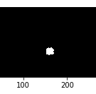
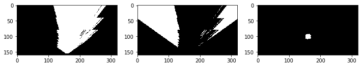

# Search and Sample space project
## Notebook Analysis 
### Obstacle and rock sample identification
In order to add obstacles and rock sample identification, two new functions are added in the **color_thresholding** section.
the first function named **obstacle_thresh**, this function takes in an image and color threshold then creates a binary image where the obstacles(pixels below the threshold) have an intensity of one and the navigable terrain have an intensity of zero.

the second function called **rock_thresh**, this function takes an image and converts it to HSV color space, then selects the pixels from the HSV image which are in the range spacified by the upper and lower bound. 
Note : to find the upper and the lower bound for the yellow color, one can use the calibration images conveting it to HSV color space and get a reasonable range for the yellow color.

**Note:The following two tutorials helped me through this section**
1-https://henrydangprg.com/2016/06/26/color-detection-in-python-with-opencv/
2-http://opencv-python-tutroals.readthedocs.io/en/latest/py_tutorials/py_imgproc/py_colorspaces/py_colorspaces.html

### process_image()
1-Using the calibration image for the grid, one can find the four points which together forms 1 square meter on the ground.
those four points are *the source points*. The destination points can be easily calculated given the dimensions of the image and the fact that 1 by 1 square on the ground corresponds to 10 by 10 pixels on the image.
2-Applying the color thresholding function then the perspective transform to the raw image can create a binary image where the navigable terrain in a top_down view have an intensity of 1 and every thing else have a zero intensity. 
3- the same strategy are applied to the image again by with replacing the color threshold function by the obstacle and rock thresholding functions.
Finally,you have three binary images corresponding to the navigable_terrain, the obstacles and the rocks.
Note:applying the color threshol first results in removing all the pixels that are not in the feild view of the camera.

4-Converting the pixels of the three images to the Rover coordinates then to the world coordinates to create a map and then update the world map.

### Autonomous Navigation and Mapping
In perception.py, I first added the two new functions **obstacle_thresh** and **rock_thresh** and modified perception_step in a similar manner to process_image() taking into account that the input image is Rover.img and the telemetry data are attributes of the class Rover not the class data as in the notebook. the new modification was the calculation of the distance and the angle using the polar coordinates and calculating the mean angle.

**Note : the simulation was running with Graphic quality: Good , Resolution :1024*768* and FPS :18.
Thanks to the slack community,I was able to get through the project.**
